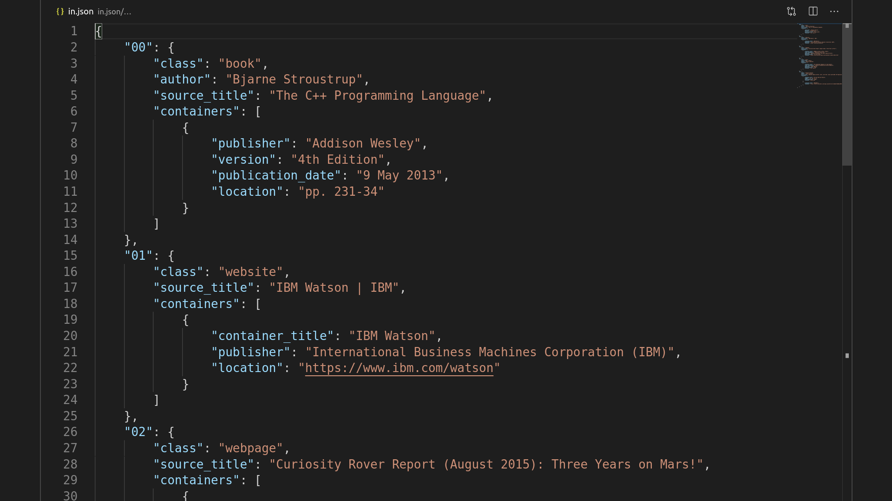
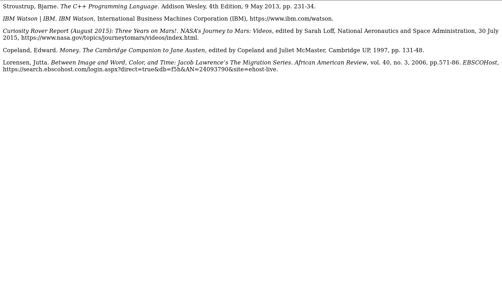

# citation-engine
Automatic Citation generator

```text
usage: main.py [-h] [-i INPUT] [-o OUTPUT] [-f FORMAT]

optional arguments:
  -h, --help            show this help message and exit
  -i INPUT, --input INPUT
                        Name of json file to input bibliography
  -o OUTPUT, --output OUTPUT
                        Name of output html file
  -f FORMAT, --format FORMAT
                        Citation format (apa, mla, ieee, chicago)
```

```bash
python3 main.py -i in.json -o out.html -f mla
```

Input:


Output:


> Now just copy the rendered HTML from browser and start using :)
